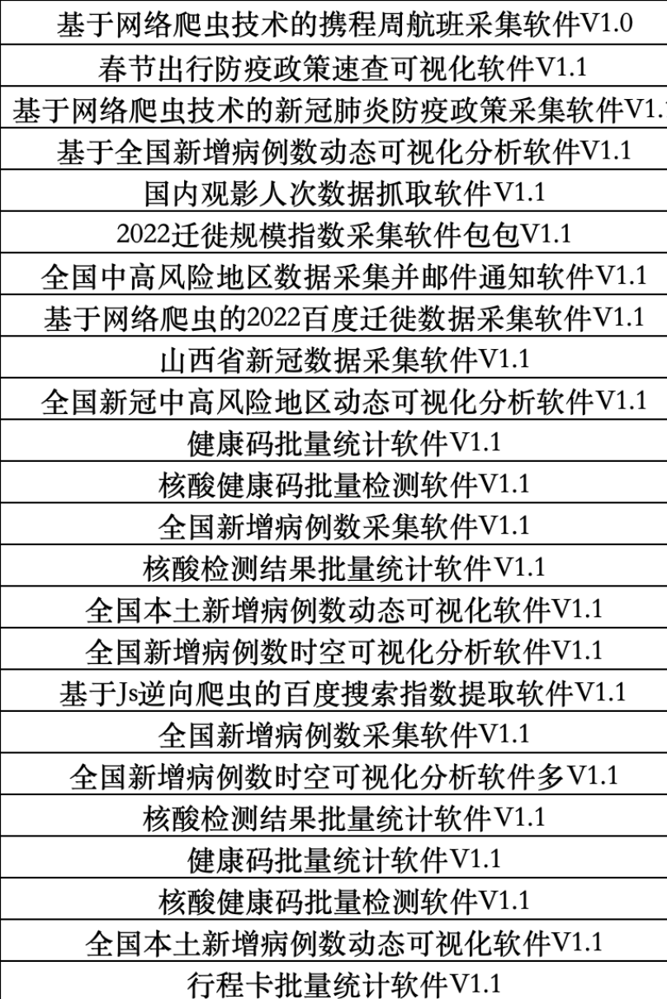
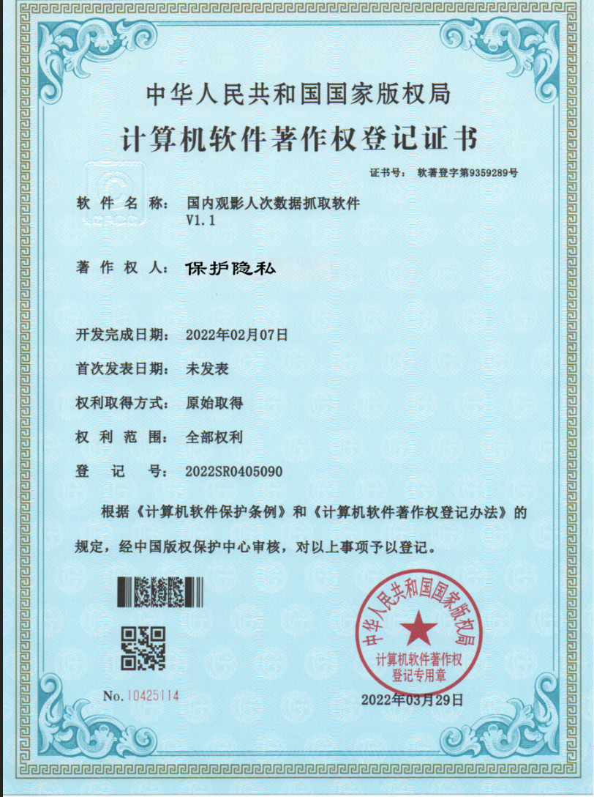
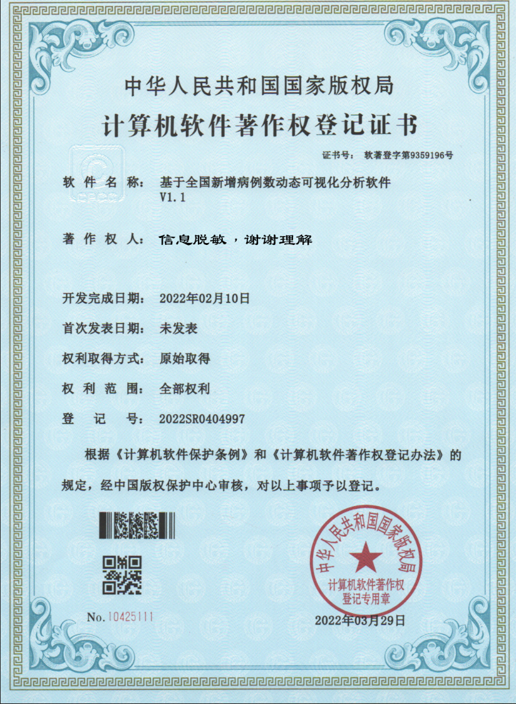
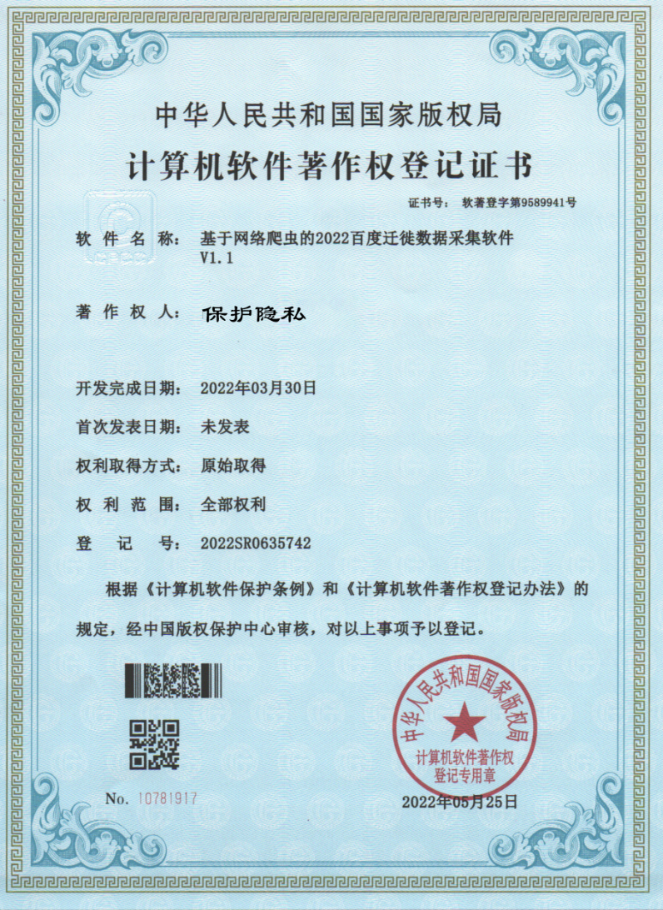
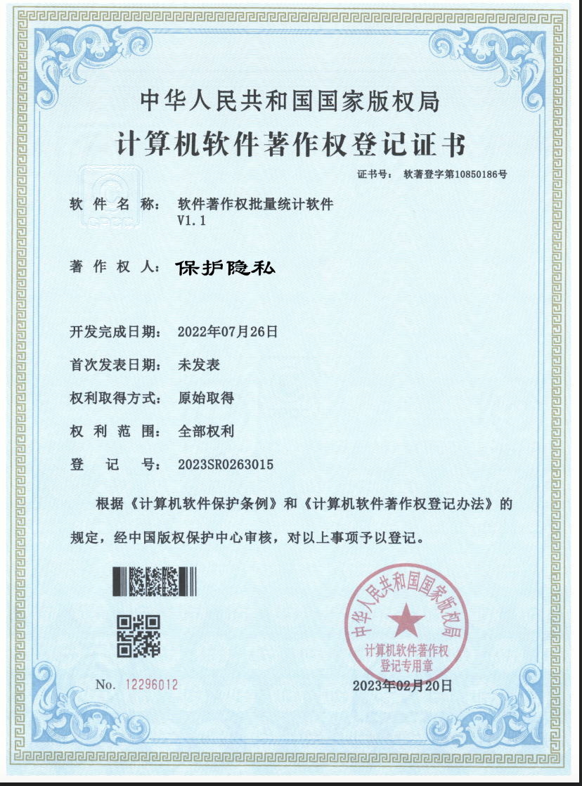
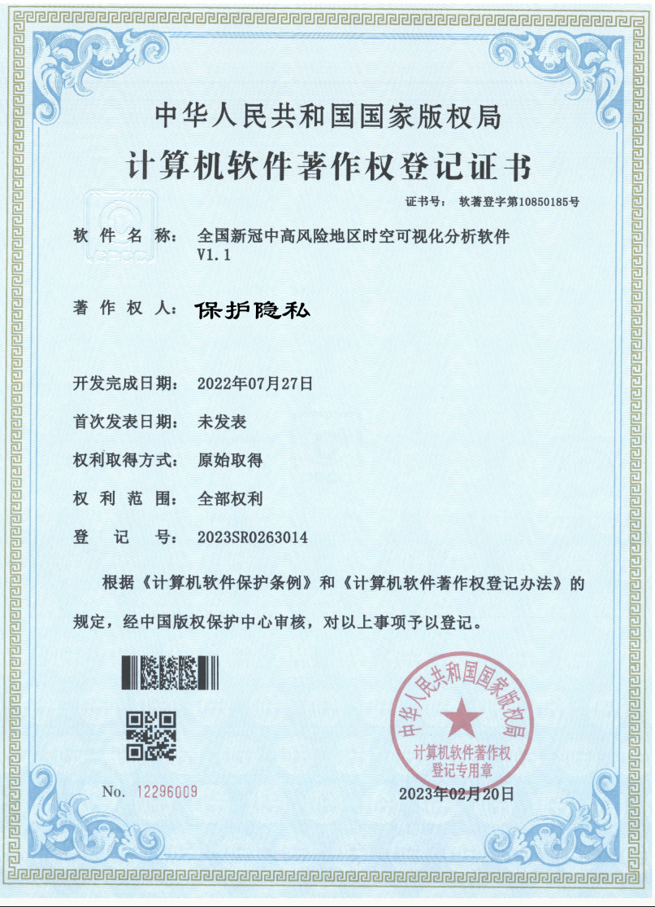
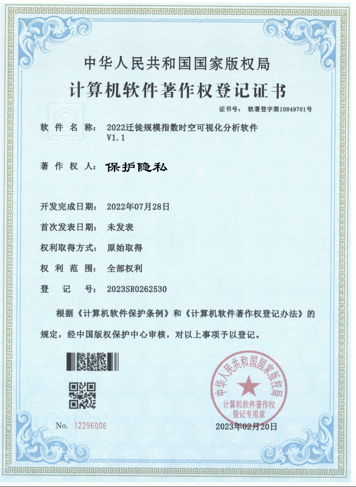

## 引言

作为一名在软件技术领域深耕多年的专业人士，我不仅在软件开发和项目部署方面积累了丰富的实践经验，更以卓越的技术实力获得了🏅30项软件著作权证书的殊荣。这些成就不仅是对我的技术专长的肯定，也是对我的创新精神和专业承诺的认可。我的专业知识涵盖了从前端界面设计到后端系统架构的全方位技能，使我能够游刃有余地应对各种复杂的技术挑战。

##  项目一览

以前做的部分项目，支持根据论文题目创新开发，实现代码的真正**零**查重，所以程序均不是套壳开发，均是新项目从技术选型到实现纯原创开发，对后续生请软件著作权有很大的帮助，进而可以获得优秀毕业论文以及优秀毕业生称号。

## 赠送服务

- 📄 **开题报告**：提供2000字左右的开题报告，为你的软件项目提供清晰的方向和规划。
- 📘 **配套技术文档**：精心编写的5000字技术文档，详细记录软件的设计和实现过程。
- 📚 **注释清楚** ：一些关键的语句会加特殊的解释。
- 🐞 **修改程序BUG**：提供软件BUG修复服务，确保你的程序稳定可靠。
-  🤔 **代码纯原创零查重** ： 不套模板，从选型到模型落地真真实实写代码。
- 📄 **软著申请说明书**：1份专业的软件著作权申请说明书，助你顺利完成版权登记。
- 🎨 **精美PPT**：提供1套精美的PPT模板，用于展示你的软件项目和成果。

## 价格
| 1259元                | 1690元                                                       |
| --------------------- | ------------------------------------------------------------ |
| 程序源码+PPT+配套文档 | 个性化定制+程序源码+部署+上线+配套文档+ 软著说明书+PPT+解答问题 |

## 我的专业领域

- 🔍 **数据采集**：使用网络爬虫技术批量采集数据存到数据库。
- 💻 **功能程序设计**：提供想法或方案，最快时间出结果，可申请软著。
- 📊 **数据可视化（含大屏）**：获取到采集的数据作为数据源，根据数据类型进行静态或者动态展示。

## 服务流程

1. 🗓️ **需求分析**：与客户沟通，明确项目需求和目标。
2. 📋 **方案设计**：根据项目管理技术提供计划和时间表。
3. 💻 **开发实施**：按照计划原型图进行软件设计和编码。
4. 🔧 **测试优化**：进行严格的测试，确保软件质量和性能。
5. 📤 **交付成果**：交付所有源代码以及附赠送的文档PPT等。
## 联系方式

- 🔖 **QQ**：471623290 
- 📧 **电子邮件**：471623290@qq.com

## 软著

 

 

 

 